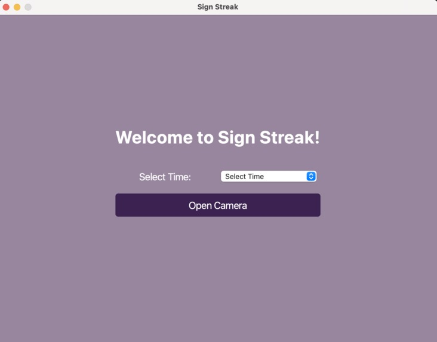
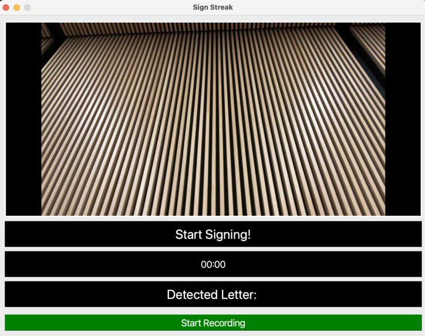
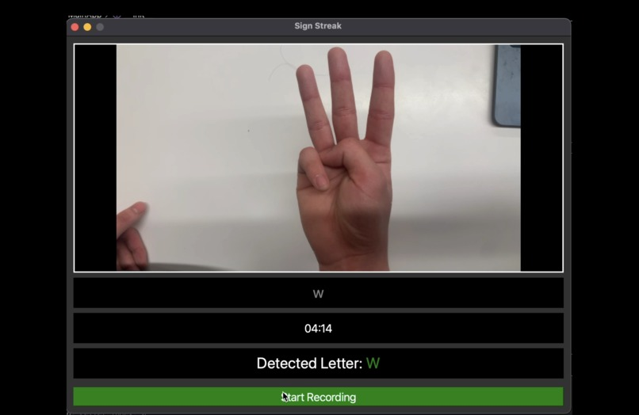
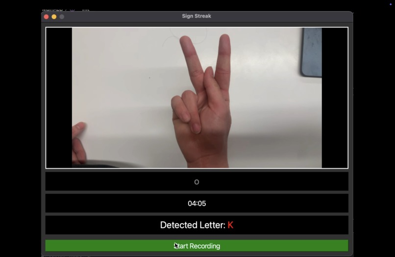
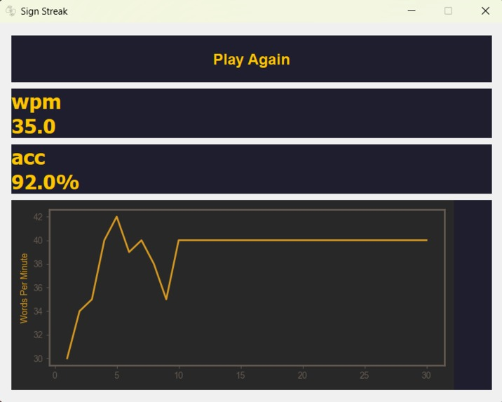

<div align="center">
  

  <h1>🤟 Sign Streak</h1>
  
  <strong>Gamified American Sign Language (ASL) Learning Platform</strong>

  <p>
    Built for <strong>DeltaHacks XI</strong>
  </p>

  <!-- Badges -->
  <p>
    
    
    
    
  </p>
</div>

---

## 📖 About The Project

Learning a new language can be daunting, and sign language is no exception. **Sign Streak** gamifies the process of learning American Sign Language (ASL) by combining real-time computer vision with a "typing test" style interface. Practice your signing speed and accuracy organically—the faster and more accurately you sign, the higher your score!

### ✨ Key Features

- **Real-Time Sign Recognition**: Translates hand gestures to letters near-instantly using a custom-trained Keras/TensorFlow model and OpenCV.
- **Gamified "Typing" Test**: Prompts the user with letters or words to sign under a time limit.
- **Immediate Visual Feedback**: Highlights correct signs in green and displays corrections for misunderstood signs in red.
- **Detailed Analytics**: Tracks your Words Per Minute (WPM) and Accuracy throughout your session, plotting your performance on an interactive line graph at the end of the test.
- **Sleek GUI**: A beautiful, intuitive cross-platform desktop application built with PyQt5.

---

## 📸 Gallery

Here’s a look at Sign Streak in action:

| **Welcome Screen** | **Preparing to Sign** |
|:---:|:---:|
|  |  |

| **Correct Sign Detection** | **Incorrect Sign / Feedback** |
|:---:|:---:|
| <br/>*Successfully signing 'W'* | <br/>*Attempting 'O' but detecting 'K'* |

### Performance Analytics
<p align="center">
  
  <br/>
  <em>Detailed post-game WPM & Accuracy breakdown using Matplotlib</em>
</p>

---

## 🛠️ Tech Stack

- **Frontend / GUI:** [PyQt5](https://pypi.org/project/PyQt5/)
- **Computer Vision:** [OpenCV (`opencv-python`)](https://opencv.org/) for capturing live webcam feed and preprocessing frames.
- **Machine Learning:** [TensorFlow](https://www.tensorflow.org/) & [Keras](https://keras.io/) for training and running the fine-tuned ASL alphabet classification model.
- **Data Visualization:** [Matplotlib](https://matplotlib.org/) for generating end-of-game performance graphs.
- **Data Processing:** [NumPy](https://numpy.org/)

---

## 🚀 Installation & Setup

1. **Clone the repository**
   ```bash
   git clone https://github.com/yourusername/sign-streak.git
   cd sign-streak
   ```

2. **Set up a virtual environment**
   ```bash
   python -m venv venv
   source venv/bin/activate
   ```

3. **Install the dependencies**
   ```bash
   pip install -r requirements.txt
   ```

4. **Run the Application**
   ```bash
   python main.py
   ```

---

## 🧠 How It Works

1. **Video Capture:** The application hooks into the user's webcam via OpenCV to read frames frame-by-frame.
2. **Model Inference:** Each frame is processed and passed through a custom TensorFlow/Keras Convolutonal Neural Network (`sign_language_model.h5` / `fine_tuned_sign_language_model.keras`).
3. **Game Loop:** The `PlayerHandler.py` module manages game state, checking user predictions against the target letter. Correct signs progress the prompt, while accuracy and completion times are logged.
4. **Stats Generation:** Upon completion, `stats.py` calculates the net WPM and overall accuracy, utilizing Matplotlib to map the learning curve.

---

*Made with ❤️ for DeltaHacks 11.*
